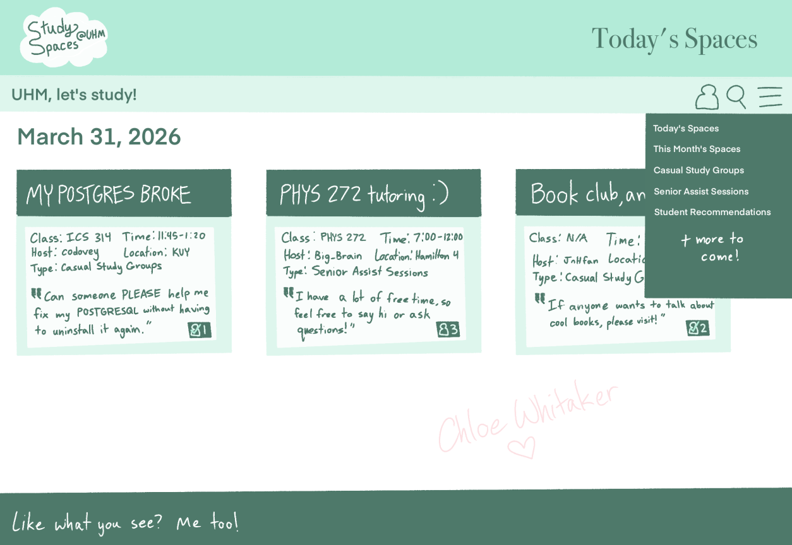

## Overview

**Problem**:
Throughout the school year, students may be stuck with a giant gap of free time between classes. In order to pass the time, many choose to study for their classes. However, studying can be a great challenge for anyone when done solo or in the wrong spot.

**Solution**:
A website listing different study spaces on UH Manoa Campus and their amenities. For example, indoor/outdoor, bathroom, outlets, noise level, lighting, chairs, space (maximum capacity of the room), food options (nearby cafe, vending machine, etc.), and more. 

## Names of the proposers
* Chloe Whitaker
* Jonell Elizabeth Udasco
* Tanner Tashiro
* Isabella Mow

## Mockup page ideas
Some possible mockup pages include: 
* Landing Page
* User home page / dashboard
* User profile page
* Admin home page

## Use case ideas
* Users can create an account to post their study spaces - Create up to 5 per week
* Users are able to click a button to show if they're interested in a space - Too many people in a room? Now you know!
* Admins can delete any questionable postings - No hateful gatherings or extreme trolling (for obvious reasons)
* Users may search for study locations based on their needs - quiet, empty, outdoors
* Users have profiles to display their current semester classes - "Wait, you're in my class?"

## Beyond the basics
After implementing the basic functionality, here are ideas for more advanced features:
* API Maps
* Ratings and Reviews of each space 

## The Concept
An Example of One Page of the Website:

It would make sense for the landing page to show the current day's study spaces. If you're new to the site, it's an easy way to find new people right away.
