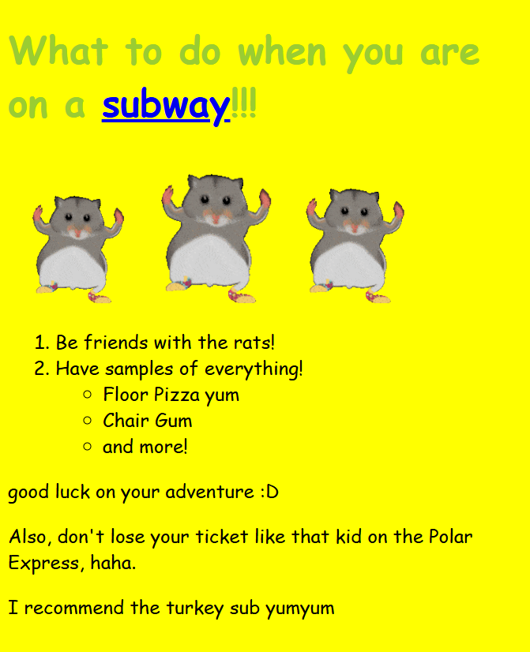

From the moment I first touched HTML lessons... I didn't hate it, which is impressive! Java wasn't so fortunate. I survived it but never fully understood it. The basics of HTML, however, were lots of fun to mess around with. You could make an intentionally ugly yet functional website with ease.

 
Kind of like this guy! It's great.

## But Wait, There's More!
It's cute that I thought I finally understood what was going on. 
### Enter Bootstrap.
The concept of Bootstrap 5 making it possible to create more complex websites is wonderful, as are most concepts, but I could not figure out how to get some things to work properly. It drives me insane!

Making everything fit together the way you want it to is no easy feat when it comes to UI frameworks. When I was recreating the Velvet Caviar website, the place I bought my current phone case, the logo *refused* to align with the other navbar list items. AI could have fixed it, but I would never stoop so low. My distaste for AI can be a story for another time.

## Being for the Benefit of Your Website
As many in software engineering would wonder, why bother with Bootstrap 5? It's certainly a torture method for someone who has no idea how to use it, and you always have to insert a few setup links to make it work. Why???

With most programming languages and extensions, understanding how it works will help a LOT. I'm still in the process of learning how to group things nicely in Bootstrap to make items appear the way I want them to. The suffering is worth it because there are cute icons and pretty gradients for your navbar. :]

## My Dovest Reaction to Bootstrap
As for HTML, it's so nice that I could give it a kiss. I'm not a professional at using it, but it isn't very threatening. Bootstrap has lots of potential, but it takes much more work to figure out. It's good over all.

